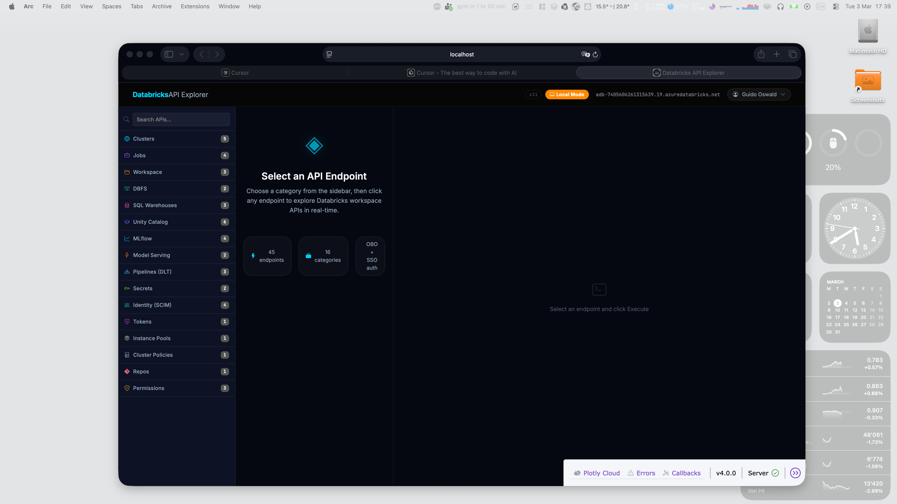

# Databricks API Explorer

An interactive REST API explorer for Databricks — covering both **Workspace** and **Account-level** APIs. Built as a Databricks App with dual-mode authentication: runs locally via Databricks CLI SSO and in production as a Databricks App using On-Behalf-Of (OBO) authentication.

---

## Screenshot



---

## Features

### API Coverage

- **32 API categories** with **76 endpoints** across both Workspace and Account REST API surfaces
- **Scope switcher** in the sidebar toggles between Workspace and Account API views

#### Workspace APIs (16 categories, 45 endpoints)

| Category | Endpoints |
|---|---|
| Clusters | List, Get, Node Types, Spark Versions, Events |
| Jobs | List Jobs, Get Job, List Runs, Get Run |
| Workspace | List Objects, Get Status, Search |
| DBFS | List Files, Get File Status |
| SQL Warehouses | List, Get, List Saved Queries |
| Unity Catalog | List Catalogs, Schemas, Tables, Volumes, Get Table, Get Metastore |
| MLflow | Search Experiments, Get Experiment, Search Runs, Registered Models |
| Model Serving | List Endpoints, Get Endpoint |
| Pipelines (DLT) | List, Get, List Events |
| Secrets | List Scopes, List Secrets |
| Identity (SCIM) | Current User, List Users, List Groups, List Service Principals |
| Tokens | List Tokens |
| Instance Pools | List Instance Pools |
| Cluster Policies | List Cluster Policies |
| Repos | List Repos |
| Permissions | Get Cluster, Job, and Warehouse Permissions |

#### Account APIs (16 categories, 31 endpoints)

| Category | Endpoints |
|---|---|
| Account Users | List Users, Get User |
| Account Groups | List Groups, Get Group |
| Service Principals | List Service Principals, Get Service Principal |
| Workspaces | List Workspaces, Get Workspace |
| Credentials | List Credential Configs, Get Credential Config |
| Storage | List Storage Configs, Get Storage Config |
| Networks | List Network Configs, Get Network Config |
| Private Access | List Private Access Settings, Get Private Access Settings |
| VPC Endpoints | List VPC Endpoints, Get VPC Endpoint |
| Encryption Keys | List Encryption Key Configs, Get Encryption Key Config |
| Log Delivery | List Log Delivery Configs, Get Log Delivery Config |
| Budgets | List Budgets, Get Budget |
| Usage Download | Download Usage (CSV) |
| Account Metastores | List Metastores, Get Metastore, List Metastore Assignments |
| Account Access Control | Get Rule Set |
| Account Settings | Get Personal Compute Setting, List IP Access Lists |

### Authentication

- **Local mode** — authenticates via the Databricks CLI (`~/.databrickscfg`). Supports all CLI auth flows: OAuth/SSO (browser-based), PAT, Azure Service Principal, Azure Managed Identity, OAuth M2M.
- **Databricks App mode** — auto-detected at runtime. Uses On-Behalf-Of (OBO) authentication: the user's access token is forwarded via the `x-forwarded-access-token` HTTP header, so every API call runs as the logged-in user. No token configuration required.
- **Custom URL / PAT** — optionally specify any workspace URL and Personal Access Token directly in the UI, bypassing the CLI entirely.
- **Account API auth** — account-scope endpoints automatically derive the accounts console URL from the workspace host and obtain an account-level token.

### Connection Management

- **User identity panel** — click the username chip in the top bar to open a slide-down panel showing:
  - Display name, username, active status
  - Auth type (OBO, OAuth/SSO, PAT, Azure SP, etc.)
  - Workspace host and account ID
  - User ID and primary email
  - Group memberships (up to 20, with overflow count)
- **CLI profile switcher** — all profiles from `~/.databrickscfg` are listed and refreshed on every panel open. Switch profiles without restarting the app.
- **Re-authenticate** — triggers `databricks auth login` for SSO re-auth directly from the UI.
- **Live connection validation** — the Connect button tests the connection before saving it to state.

### Request Builder

- **Parameter forms** — each endpoint renders a type-aware form with required/optional badges and inline descriptions
- **Path parameter interpolation** — path parameters (e.g. `{cluster_id}`) are extracted from the URL and shown as dedicated fields
- **JSON body editor** — POST endpoints show a pre-populated JSON textarea with the correct request schema
- **Real-time search** — filter endpoints across all categories by name, path, method, or category
- **Configurable timeout** — per-request timeout control with a spinner input next to the Execute button (defaults vary by endpoint, e.g. 120 s for Usage Download)
- **Auto-fill account ID** — account-scope endpoints automatically populate the `account_id` field from the current CLI profile

### Response Viewer

- **Collapsible JSON tree** — interactive tree viewer rendered in an iframe with expand/collapse toggles, inline syntax highlighting, and compact previews for collapsed nodes
- **Inline ID links** — list API responses render clickable ID chips on matching fields; clicking one fires the corresponding Get API and pre-fills the parameter form
- **Side panel with chip list** — list responses show a scrollable side panel of result chips with labels, allowing quick drill-down into individual items
- **Action buttons on chips** — some list endpoints expose secondary actions (e.g. "List workspace assignments" on metastores) directly on each chip
- **Response metadata bar** — HTTP status code (color-coded), latency in ms, item count for list responses, full request URL
- **CSV viewer** — endpoints that return CSV data (e.g. Usage Download) are rendered as a scrollable HTML table
- **curl command** — every executed request generates a ready-to-copy `curl` command displayed below the Execute button, with a one-click copy button

### Pagination

- **Automatic pagination** — when a response contains a `next_page_token`, the app automatically fetches subsequent pages and merges them into a single result
- **"Load All" button** — for APIs with `has_more`-style pagination, a "Load All" button in the side panel fetches all remaining pages in a background thread with live progress updates
- **Abort controls** — both automatic pagination and Load All can be cancelled mid-flight; Load All auto-cancels when switching to a different endpoint

### Resizable Side Panel

- **Drag-to-resize** — the side panel has a left-edge resize handle; drag to adjust width between 20% and 80% of the viewport
- **Persistent width** — panel width is saved to `localStorage` and restored across page reloads

### UI & UX

- **Glassmorphism dark theme** — custom CSS with CSS variables, neon accent colors, backdrop-filter blur effects
- **CYBORG Bootstrap theme** via `dash-bootstrap-components`
- **Scope switcher** — toggle between Workspace and Account API catalogs in the sidebar
- **Mode badge** in the top bar shows whether running as `Local Mode` or `Databricks App`
- **Workspace host display** in the top bar with a clickable link to the workspace
- **Auto-incrementing build version** — `version.py` bumps a counter on every app start, displayed as `v<N>` in the topbar
- **Accordion sidebar** with category icons, per-category endpoint counts, and method color badges (GET/POST/PUT/DELETE/PATCH)
- **Active endpoint highlighting** — selected endpoint button is highlighted in the sidebar
- **Debug bar patches** — MutationObserver removes the Plotly Cloud button and injects workspace URL links into the Dash debug bar

---

## Architecture


```
┌─────────────────────────────────────────────────────────┐
│                      Browser / User                     │
└────────────────────────────┬────────────────────────────┘
                             │ HTTP
┌────────────────────────────▼────────────────────────────┐
│                    Dash / Flask (app.py)                 │
│                                                         │
│  ┌─────────────┐  ┌──────────────┐  ┌───────────────┐  │
│  │   TOPBAR    │  │   SIDEBAR    │  │  MAIN CONTENT │  │
│  │  user chip  │  │  scope switch│  │               │  │
│  │  host label │  │  accordion   │  │  ┌──────────┐ │  │
│  │  mode badge │  │  search      │  │  │  form    │ │  │
│  └──────┬──────┘  │  endpoints   │  │  │  panel   │ │  │
│         │         └──────┬───────┘  │  └──────────┘ │  │
│  ┌──────▼──────┐         │          │  ┌──────────┐ │  │
│  │ USER        │         │          │  │ response │ │  │
│  │ DROPDOWN    │         │          │  │ tree +   │ │  │
│  │ (fixed pos) │         │          │  │ side     │ │  │
│  └─────────────┘         │          │  │ panel    │ │  │
│                           │          │  └──────────┘ │  │
│  ┌────────────────────────▼──────────┴───────────┐   │
│  │              dcc.Store (conn-config)            │   │
│  │   {"mode": "profile"|"custom",                 │   │
│  │    "profile": "<name>" | "host": "...",         │   │
│  │    "token": "..."}                              │   │
│  └────────────────────────┬──────────────────────┘   │
└───────────────────────────│───────────────────────────┘
                            │
         ┌──────────────────▼──────────────────┐
         │             auth.py                 │
         │                                     │
         │  _resolve_conn()                    │
         │    ├─ IS_DATABRICKS_APP?             │
         │    │   └─ host from DATABRICKS_HOST  │
         │    │      token from x-forwarded-   │
         │    │      access-token header        │
         │    └─ local mode                    │
         │        ├─ profile → SDK Config()    │
         │        └─ custom → host + PAT        │
         │                                     │
         │  make_api_call()                    │
         │    └─ requests.request()            │
         └──────┬───────────────────┬──────────┘
                │                   │
 ┌──────────────▼───────┐ ┌────────▼──────────────────┐
 │  Databricks REST API │ │  Databricks Accounts API  │
 │  (workspace host)    │ │  (accounts console host)  │
 └──────────────────────┘ └───────────────────────────┘
```

### Key Components

| File | Responsibility |
|---|---|
| `app.py` | Dash app, layout, all callbacks (19+ callbacks) |
| `auth.py` | Auth resolution, profile discovery, account token exchange, `make_api_call()` |
| `api_catalog.py` | Endpoint catalog (32 categories, 76 endpoints), chip extraction, list-to-get linking |
| `version.py` | Auto-incrementing build version counter |
| `assets/style.css` | Full dark glassmorphism CSS theme |
| `assets/devtools_patch.js` | Debug bar patches + resizable side panel |
| `app.yaml` | Databricks Apps runtime config (command + env) |
| `databricks.yml` | Asset Bundle config for DABs deployment |
| `resources/api_explorer.app.yml` | DABs app resource definition |

### Auth Flow

```
                ┌─────────────────────────────────┐
                │         App Startup              │
                │  IS_DATABRICKS_APP =             │
                │  bool(DATABRICKS_CLIENT_SECRET)  │
                └──────────┬──────────────────────┘
                           │
           ┌───────────────┴───────────────┐
           │ False (local)                 │ True (Databricks App)
           ▼                               ▼
  conn-config store               x-forwarded-access-token
  (profile | custom)              header from Databricks
           │                      platform (OBO)
           ▼                               │
  SDK Config(profile=...)                  │
  or custom host + PAT                     │
           │                               │
           └───────────────┬───────────────┘
                           ▼
                  make_api_call(method, path,
                                token, host)
                           │
              ┌────────────┴────────────┐
              │ scope == "workspace"    │ scope == "account"
              ▼                         ▼
     workspace host            _accounts_host() derives
                               accounts console URL
```

### Callback Graph

```
url / conn-config ──► init_on_load ──► user-display, host-display
user-btn ──────────► toggle_dropdown ──► user-dropdown (open/close)
                                      ► popup-* (identity)
                                      ► profile-select options (refreshed)
conn-mode-radio ───► toggle_conn_mode ──► profile-section / custom-section
profile-select ────► show_profile_hint ──► profile-auth-type hint
apply-conn-btn ────► apply_connection ──► conn-config store
reauth-btn ────────► reauth ──► reauth-status
scope-switch ──────► switch_scope ──► sidebar categories (workspace/account)
endpoint-btn[ALL] ─► select_endpoint ──► selected-endpoint store
selected-endpoint ─► sync_active_button ──► endpoint-btn[ALL] className
selected-endpoint ─► render_endpoint_detail ──► endpoint-detail, param form
execute-btn ───────► execute_api_call ──► response-container, curl command
                   ► start_pagination ──► auto-fetch next pages
search-input ──────► filter_endpoints ──► endpoint-btn[ALL] styles
id-link-btn ───────► handle_id_link_click ──► selected-endpoint, response
load-all-btn ──────► start_load_all ──► background thread + ticker
last-req ──────────► update_curl_display ──► curl-text, curl-display
```

---

## Technology Stack

| Layer | Technology |
|---|---|
| **Framework** | [Dash 4.x](https://dash.plotly.com/) (Plotly) |
| **UI Components** | [dash-bootstrap-components](https://dash-bootstrap-components.opensource.faculty.ai/) — CYBORG theme |
| **Icons** | Bootstrap Icons (via CDN) |
| **HTTP Client** | [requests](https://requests.readthedocs.io/) |
| **Databricks SDK** | [databricks-sdk](https://github.com/databricks/databricks-sdk-py) — profile-based auth |
| **Web Server** | Flask (embedded in Dash) |
| **Styling** | Custom CSS — glassmorphism dark theme with CSS variables |
| **Deployment** | [Databricks Asset Bundles (DABs)](https://docs.databricks.com/dev-tools/bundles/) |
| **Auth (local)** | Databricks CLI (`~/.databrickscfg`) — OAuth/SSO, PAT, Azure SP |
| **Auth (app)** | OBO via `x-forwarded-access-token` header |
| **Runtime** | Python 3.11+, Ubuntu 22.04 (on Databricks Apps) |

---

## Local Development

### Prerequisites

- Python 3.11+
- [Databricks CLI](https://docs.databricks.com/dev-tools/cli/index.html) configured with at least one profile
- `pip install -r requirements.txt`

### Run

```bash
python app.py
```

Open [http://localhost:8050](http://localhost:8050).

The app auto-detects local mode (no `DATABRICKS_CLIENT_SECRET` env var) and uses the first CLI profile from `~/.databrickscfg` by default.

---

## Deployment to Databricks Apps

### Deploy via Asset Bundle (recommended)

```bash
# Deploy to dev target (uses your configured profile)
databricks bundle deploy

# Start the app
databricks bundle run api_explorer
```

### Deploy via CLI

```bash
databricks apps deploy databricks-api-explorer \
  --source-code-path . \
  --profile <your-profile>
```

### View Logs

```bash
databricks apps logs databricks-api-explorer --profile <your-profile>
```

---

## Project Structure

```
DatabricksAPIexplorer/
├── app.py                        # Main Dash app + all callbacks
├── auth.py                       # Auth resolution + API call helper
├── api_catalog.py                # Endpoint catalog (32 categories, 76 endpoints)
├── version.py                    # Auto-incrementing build version
├── version.txt                   # Current build number (auto-updated)
├── requirements.txt              # Python dependencies
├── app.yaml                      # Databricks Apps runtime config
├── databricks.yml                # Asset Bundle main config
├── resources/
│   └── api_explorer.app.yml      # DABs app resource definition
└── assets/
    ├── style.css                 # Dark glassmorphism CSS theme
    ├── devtools_patch.js         # Debug bar patches + resizable side panel
    └── screenshot.png            # App screenshot
```
